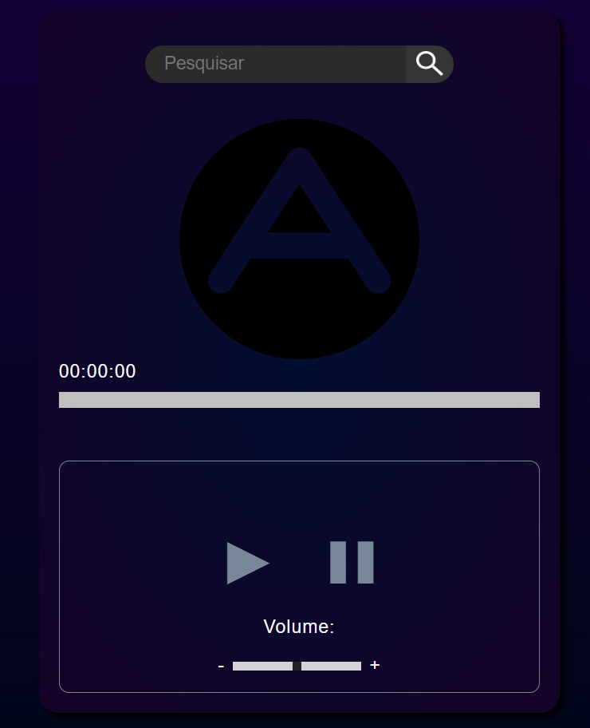

# AngleMusic

<h5>Este projeto não possui nenhum fim lucrativo, ao contrário, foi feito exclusivamente para fins de aprendizado, diversão e nota para a matéria estudada no terceiro semestre do Curso Técnico Integrado em Informática do Instituto Federal do Ceará.</h5>

<h2>Screenshots</h2>

<h2>Features</h2>
<h56>O usuário pode através da nossa aplicação pesquisar e reproduzir qualque música que queira, podendo ainda, controlar a barra de progresso da mesmo.</h5>

<h2>Tecnologias</h2>
<h5>Para listar as tecnologias podemos dividí-las em duas partes do desenvolvimento:</h5>
<h3>Front-end e interface</h3>
<h5>Desenvolvemos a interface da aplicação utlizando HTML5 e CSS3, além de dinamizarmos certas partes com o JavaScript com JQuery, usando esse também para organizar as informações requeridas da API no momento de reprodução da música e a listagem das músicas disponíveis com os títulos buscados.</h5>
<h3>Back-end e API</h3>
